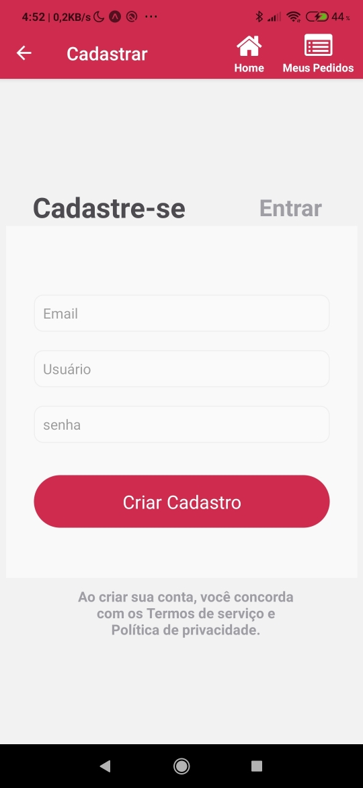
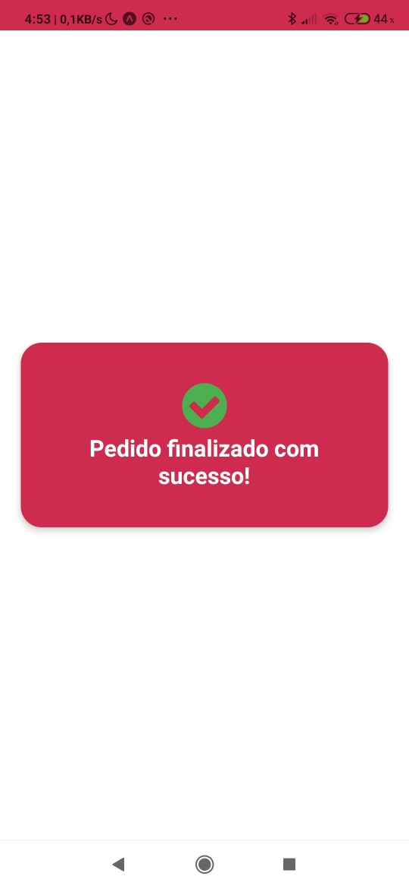
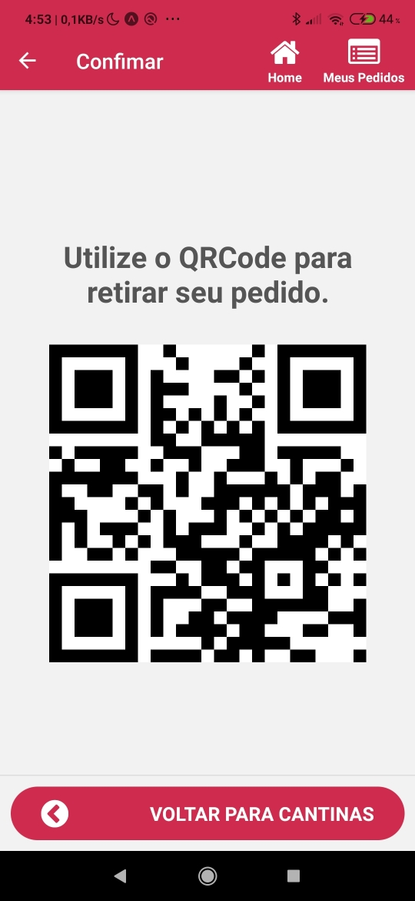

# ABP com React Native e Expo

## Objetivo

O App deverá ter este mínimo de recursos:
* Nome e Ícone personalizados
* No mínimo 5 telas
* Persistência de dados (banco)
* No mínimo 1 CRUD-like (cadastro, edição, listagem, visualização de detalhes e não obrigatório ~ excluir)
* Consumo de recursos on-line será um plus

Como não teve tempo ara ser desenvolvido uma API, foram utilizados arquivos JSON para simular as respostas da API.

## Comandos utilizados

Baixar e instalar o Nodejs versão 12.

Instalar o Expo Client.
```
npm install -g expo-cli
```

Criar um novo projeto.
```
expo init novo-projeto
```
Entrar na pasta do projeto e iniciar o Expo Client.
```
cd novo-projeto
expo start
```
## Instalando componentes extras
na pasta do projeto, rodar o comando:
```
npm install --save
```
E instalar as dependencias abaixo para s pacotes extras.
```
npm install --save @react-navigation/native

npm install --save @react-navigation/stack

expo install react-native-gesture-handler react-native-reanimated react-native-screens react-native-safe-area-context @react-native-community/masked-view

npm install --save @react-native-async-storage/async-storage

npm install --save react-native-svg  react-native-qrcode-svg

```

### QrCode
Tutorial utilizado para instalar e gerar o QRCode:
https://aboutreact.com/generation-of-qr-code-in-react-native/

```
npm install react-native-svg --save
npm install react-native-qrcode-svg --save
```

por fim:
```
npm install --save
```

## Proximos passos para o projeto
* *Desenvolver a API no lado do servidor.*

* *Utilizar rotina de cache para economizar dados moveis/internet.*

* *Fazer logica de login e senha para clientes com autenticação no sevidor.*

* *Fazer melhorias na tela de pedidos.*

* *Desenvolver o aplicativo com design responsivo abrangendo varios dispositivos.*

* *Desenvolver a aplicação destinada as cantinas, com cadatro de informações da empresa e itens para venda.*

* *Desenvolver aplicação para gerenciamento das instituições de ensino, para listagem das cantinas.*

## Autores
* Jonas P. Geremias
* Mariane Joquim Melo
* Clairton Zerwes
* Filipi Piucco

## Professor
Lucas Resendes Ferreira

## Apresentação

<object data="./docs/EasySnack.pdf" type="application/pdf" width="700px" height="700px">
    <embed src="./docs/EasySnack.pdf">
        <p>This browser does not support PDFs. Please download the PDF to view it: <a href="./docs/EasySnack.pdf">Download PDF</a>.</p>
    </embed>
</object>

## Telas do projeto
* Splash screen inicial


* LoginScreen.js


* CadastroUserScreen.js


* CompaniesScreen.js


* CardapioScreen.js


* ConfirmarPedidoScreen.js


* Splash pedido em andamento


* Splash pedido realizado


* QRCode do pedido 


* PedidosScreen.js


* QRCode do pedido
